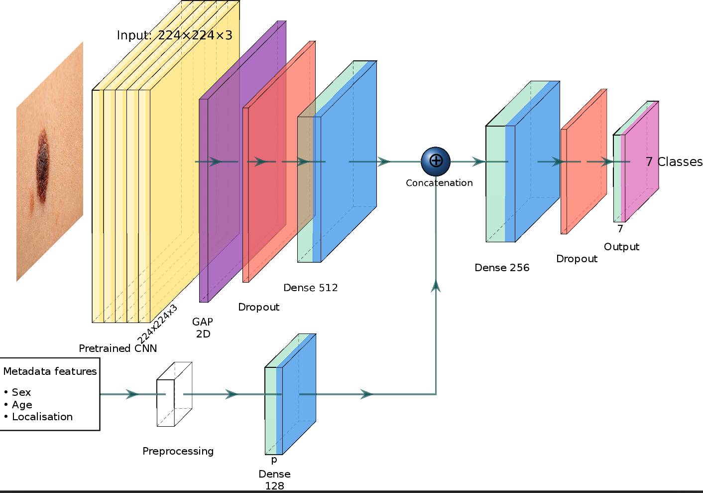
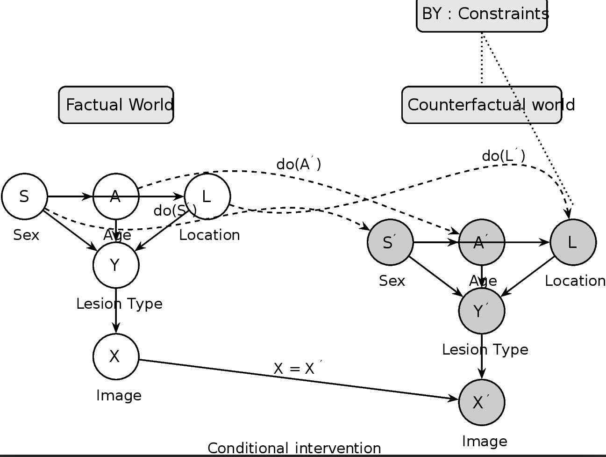
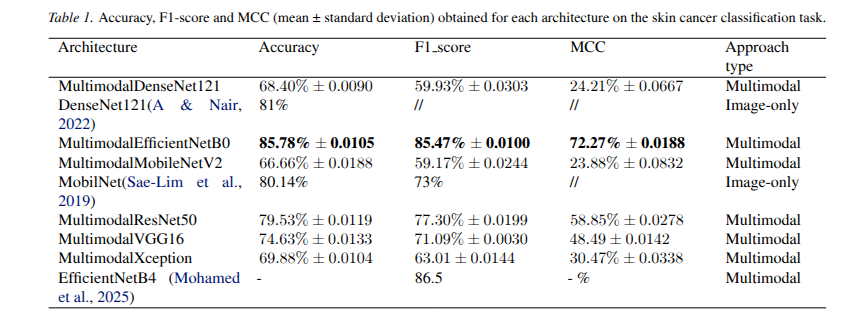
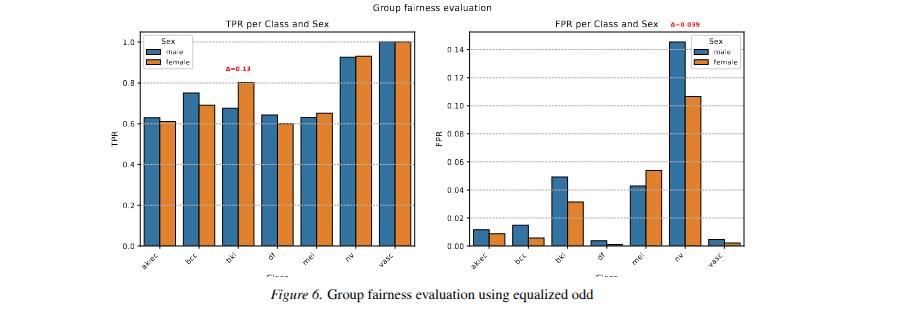
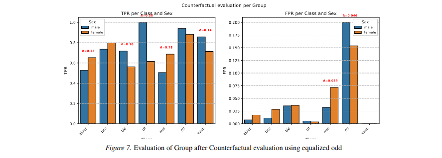

# Still Malignant if You Were a Woman? Auditing Group and Counterfactual Fairness in Dermatological AI

We propose a multimodal architecture that leverages the principles of transfer learning and late fusion to combine visual data and metadata in a classification framework efficiently. The architecture begins by initializing a pretrained model on ImageNet with 1.2 million images and 1,000 classes, from which the final classification layer is removed to allow adaptation to our task. These pre-learned features enable us to obtain a solid base of features that accelerate convergence and improve performance, particularly with limited datasets. This fine-tuning strategy represents an optimal balance between adaptation and stability. We allow the deep layers to adapt to the specificities of this domain while preserving the generic feature detectors learned in the shallow layers, thus avoiding catastrophic forgetting. We also allow targeted specialization by setting base model.trainable = True and then freezing the first layers.


## Dataset

This work uses the **HAM10000** (*Human Against Machine with 10000 training images*) dataset, a large-scale collection of dermatoscopic images from the ISIC Archive.

| Property | Value |
|---|---|
| Total images | 10,015 |
| Image resolution | 450 × 600 px (resized to 224 × 224) |
| Number of classes | 7 |
| Metadata | age, sex, anatomical localization |
| Source | [Kaggle](https://www.kaggle.com/datasets/kmader/skin-cancer-mnist-ham10000) |

---

## Installation

**Requirements:** Python ≥ 3.8

```bash
# 1. Clone the repository
git clone https://github.com/Herman-Motcheyo/Group-and-Counterfactual-Fairness-in-Dermatological-AI.git
cd Group-and-Counterfactual-Fairness-in-Dermatological-AI

# 2. Install Python dependencies
pip install tensorflow>=2.10 scikit-learn pandas numpy pillow
pip install matplotlib seaborn scipy joblib dvc

# 3. Pull the dataset via DVC
dvc pull
```

---

## R
**2. Serialized fold indices**

Cross-validation splits are computed once and written to `cross_val_index.json`. All subsequent runs load this file, ensuring that train/validation/test sets are identical across experiments and machines.

```python
validator = StratifiedCrossValidator(n_splits=5, test_size=0.2, val_size=0.1)
splits = validator.create_stratified_splits_finale(df, 'dx')
# This overwrites cross_val_index.json
```

**3. Serialized preprocessors**

All fit transformers (LabelEncoder, OneHotEncoder, StandardScaler) are saved per fold under `encoders/fold_N/` using `joblib`, enabling inference on new data without refitting.

```
encoders/
└── fold_0/
    ├── 0_label_encoder.pkl
    ├── 0_onehot_encoder.pkl
    └── 0_scaler_age.pkl
```

---

## Running the Pipeline

```bash
python main.py
```

This will:
1. Load and merge the HAM10000 dataset
2. Run stratified 5-fold cross-validation
3. Train EfficientNetB0 (default) with metadata fusion
4. Save models, encoders, training logs, and evaluation metrics

To train a different backbone, modify `models_to_train` in `main.py`:

```python
histories = train_multiple_models(
    framework=mul_cnn,
    validator=validator,
    df=df,
    column_name_to_discretize=['sex', 'localization'],
    models_to_train=['resnet', 'densenet', 'xception'],   # choose here
    NUMBER_OF_FOLDS=5,
    save_dir='histories'
)
```

Available options: `'resnet'`, `'xception'`, `'densenet'`, `'efficientnet'`, `'mobilenet'`, `'vgg'`.


## Results
    

---

## Citation

If you use this code or framework in your research, please cite:


---

## License

This project is licensed under the MIT License. For commercial use, permission is required.
